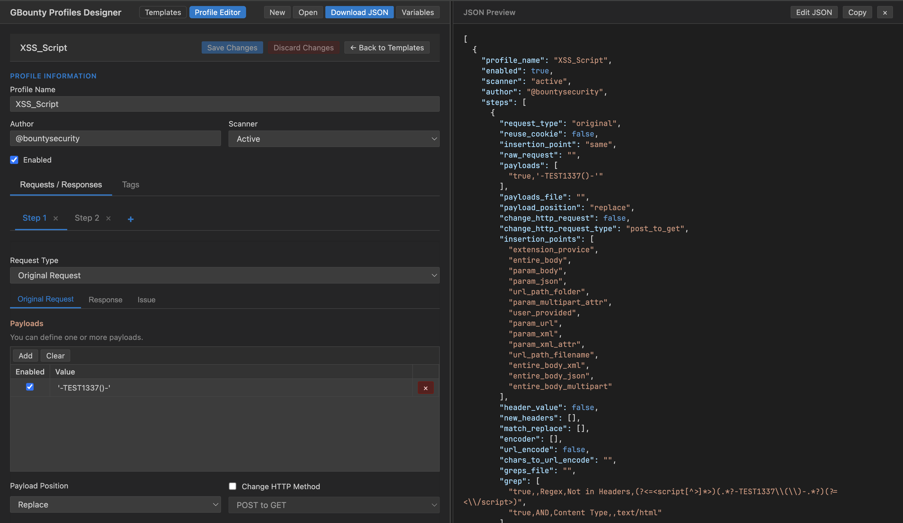

# GBounty Profiles Designer Web

A modern HTML/JavaScript alternative to the original [GBounty Profiles Designer](https://github.com/BountySecurity/GBountyProfilesDesigner) for creating and managing security testing profiles for [GBounty](https://github.com/BountySecurity/gbounty).



## 🎯 About

This is a **web-based alternative** to the original Java-based GBounty Profiles Designer. It provides the same functionality but runs entirely in your browser with no installation required.

### Related Projects
- **[GBounty](https://github.com/BountySecurity/gbounty)** - The main Burp Suite extension for security testing
- **[GBounty Profiles Designer](https://github.com/BountySecurity/GBountyProfilesDesigner)** - Original Java-based profile designer
- **This Project** - Modern HTML/JS alternative for web browsers

## ✨ Features

### Multi-Template Management
- **Create Multiple Templates**: Generate unlimited security testing profiles
- **Template Library**: Organize and manage all your templates in one place
- **Real-time Statistics**: Track total, active, passive, and recently modified templates
- **Search & Filter**: Quickly find templates by name, author, or content
- **Persistent Storage**: All templates saved locally in your browser

### Template Operations
- **Create**: Generate new templates with custom names
- **Edit**: Modify existing templates with live JSON preview
- **Duplicate**: Clone templates for quick variations
- **Delete**: Remove unwanted templates with confirmation
- **Import/Export**: Full compatibility with .bb2 and .json profile formats
- **Bulk Operations**: Import multiple templates at once

### Enhanced User Experience
- **No Installation Required**: Runs entirely in your web browser
- **Unsaved Changes Detection**: Warns before losing modifications
- **Auto-save**: Templates automatically saved to browser storage
- **Session Persistence**: Maintains your work across page reloads
- **Visual Indicators**: Clear status indicators for template states
- **Modern UI**: Clean, responsive interface with dark theme

## 🚀 Getting Started

### Quick Start
1. Open `index.html` in your web browser
2. Click **"New"** to create your first template
3. Configure your security testing profile
4. Click **"Save Changes"** to save your template
5. Use **"Download JSON"** to export for use with GBounty

#### Creating Templates
1. Click **"New"** button in the header
2. Enter a descriptive template name
3. The template will be created and automatically opened for editing

#### Editing Templates
1. Click on any template in the list to load it
2. Switch to the **"Requests / Responses"** tab
3. Make your changes using the visual editor
4. Click **"Save Changes"** to persist modifications

#### Bulk Operations
- **Import Templates**: Click "Import" to load templates from .bb2 or .json files
- **Download All**: Export all templates as a single .bb2 file
- **Individual Download**: Use the download button (↓) on each template

#### Template Actions
- **Duplicate** (⧉): Create a copy of the template
- **Download** (↓): Export individual template as .bb2 file
- **Delete** (×): Remove template (with confirmation)

### Search and Organization
- Use the search box to filter templates by name, author, or content
- Templates show badges indicating their type (Active/Passive) and status
- Recently modified templates are highlighted in statistics

## 🔧 Technical Features

### Data Persistence
- Templates are stored in browser's localStorage
- Automatic backup on every change
- Import/export for data portability

### Template Structure
Each template includes:
- **Metadata**: Name, author, creation/modification dates
- **Profile Configuration**: Scanner type, enabled status
- **Steps**: Request/response configurations
- **Tags**: Organizational labels

### File Formats
- **Export Format**: Standard .bb2 files (JSON arrays)
- **Import Support**: .bb2 and .json files
- **Compatibility**: Full compatibility with existing GBounty profiles

## 📊 Template Statistics

The dashboard shows:
- **Total**: Number of templates in your library
- **Active**: Templates with active scanner type
- **Passive**: Templates with passive scanner types
- **Recent**: Templates modified in the last 7 days

## 🎯 Use Cases

### Security Testing Teams
- Create template libraries for different vulnerability types
- Share templates across team members via export/import
- Organize templates by project, client, or vulnerability category

### Individual Researchers
- Build personal collections of testing profiles
- Experiment with variations using the duplicate feature
- Maintain organized libraries of proven testing methodologies

### Training and Education
- Create template sets for different skill levels
- Share educational templates with students
- Build comprehensive testing suites for learning

## 🔄 Migration from Single Template

If you were using the previous single-template version:
1. Your existing template is automatically preserved
2. Use "Import" to load any existing .bb2 files
3. Create new templates as needed
4. Export your collection for backup

## 💡 Tips and Best Practices

### Template Organization
- Use descriptive names that indicate the vulnerability type
- Include author information for team environments
- Use tags to categorize templates by type, severity, or project

### Workflow Optimization
- Create base templates and duplicate them for variations
- Use the search function to quickly locate specific templates
- Regularly export your template library for backup

### Performance
- The application handles hundreds of templates efficiently
- Search is performed in real-time as you type
- Templates are loaded on-demand for optimal performance

## 🛠️ Development

### File Structure
```
js/
├── template-manager.js    # Core template management logic
├── main.js               # Enhanced application controller
├── ui.js                 # User interface components
├── schema.js             # Data structures and validation
└── utils.js              # Utility functions

css/
└── style.css             # Enhanced styling with template manager UI

index.html                # Main application interface
```

### Key Classes
- **TemplateManager**: Handles CRUD operations and data persistence
- **App**: Main application controller with template integration
- **UI**: Enhanced user interface with template management components

## 🔒 Security Considerations

- All data is stored locally in the browser
- No external network requests for template data
- Import/export uses standard file system APIs
- Templates are validated before import

## 🚀 Future Enhancements

Potential future features:
- Cloud synchronization
- Template sharing marketplace
- Advanced filtering and sorting
- Template versioning
- Collaborative editing
- Template validation and testing

---

**Note**: This web-based alternative maintains full compatibility with GBounty profiles (.bb2/.json formats) and provides a modern, browser-based interface for profile management without requiring Java installation.